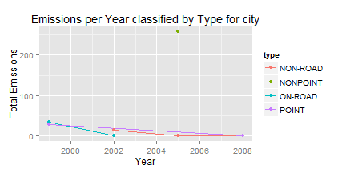

## Introduction

- I create a shiny app to make an exploratory analysis of the PM2.5 Emissions.
- This app has as input a combo with the cities and two slides for the years for 
define the periods.
- The output is a ggplot with the total emissions and grouped by years and type 
of sources.
- Fine particulate matter (PM2.5) is an ambient air pollutant for which there is 
strong evidence that it is harmful to human health. In the United States, the 
Environmental Protection Agency (EPA) is tasked with setting national ambient 
air quality standards for fine PM and for tracking the emissions of this 
pollutant into the atmosphere. Approximatly every 3 years, the EPA releases its 
database on emissions of PM2.5. This database is known as the National Emissions 
Inventory (NEI). You can read more information about the NEI at the [EPA National Emissions Inventory web site](http://www.epa.gov/ttn/chief/eiinformation.html).

---
## ui.R
```
library(shiny)

shinyUI(pageWithSidebar(
        headerPanel('PM2.5 Emissions Exploratory Analysis'),
        sidebarPanel(
                selectInput('city', 'Choose the city', choices = c('Baltimore' = 24510, 'Los Angeles' = 06037, 'Washington' = 24043)),
                sliderInput('startYear', 'Choose the starting year', min = 1999, max = 2008, value = 1999),
                sliderInput('endYear', 'Choose the ending year', min = 1999, max = 2008, value = 2008)
        ),
        mainPanel(
                p('This shiny app will show you the Total PM2.5 Emissions for a 
                  period of years grouped by type of sources. Load the data take a 
                  minutes, please wait.'),
                h4('The city FIPS you chose:'),
                verbatimTextOutput('city'),
                h4('The starting year you chose:'),
                verbatimTextOutput('startYear'),
                h4('The ending year you chose:'),
                verbatimTextOutput('endYear'),
                h4('The total PM2.5 emissions in the selected year period'),
                plotOutput('pm25Plot'),
        )
))
```

---
## server.r
```
library(dplyr)
library(ggplot2)
NEI <- read.table("summarySCC_PM25_Sub.txt", header = T)
makePlot <- function(city, startYear, endYear) {
        new_city <- as.character(city)
        if (nchar(new_city) == 4) 
                new_city <- paste("0", new_city, sep = "")
        Comparison <- subset(NEI, fips == new_city & year >= startYear & year <= endYear)
        Emissions_Year <- Comparison %>% group_by(year, type) %>% summarize(totalemission = sum(Emissions))
        pm25Plot <- ggplot(Emissions_Year, aes(year, totalemission)) + geom_line(aes(col = type)) + geom_point(aes(col = type)) + xlab("Year") + ylab("Total Emissions") + ggtitle("Emissions per Year classified by Type for city")
        return(pm25Plot)
}

shinyServer(
        function(input, output) {
                new_city <- function() {
                        x <- as.character(input$city)
                        if (nchar(x) == 4) 
                                x <- paste("0", x, sep = "")
                        return(x)
                }
                output$city <- renderText({new_city()})
                output$startYear <- renderPrint({input$startYear})
                output$endYear <- renderPrint({input$endYear})
                output$pm25Plot <- renderPlot({makePlot(input$city, input$startYear, input$endYear)})
        }
)
```

---
## Example


```r
NEI <- read.table("summarySCC_PM25_Sub.txt", header = T, stringsAsFactors = F)
Comparison_Baltimore <- subset(NEI, fips == "06037")
Emissions_Year <- Comparison_Baltimore %>% group_by(year, type) %>% summarize(totalemission = sum(Emissions))
ggplot(Emissions_Year, aes(year, totalemission)) + geom_line(aes(col = type)) + geom_point(aes(col = type)) + xlab("Year") + ylab("Total Emissions") + ggtitle("Emissions per Year classified by Type for city")
```



- The app can be founded [here](https://josvil.shinyapps.io/Shiny_App_Project/) 
and the entire code [here](https://github.com/JosVil26/ShinyAppProject).
